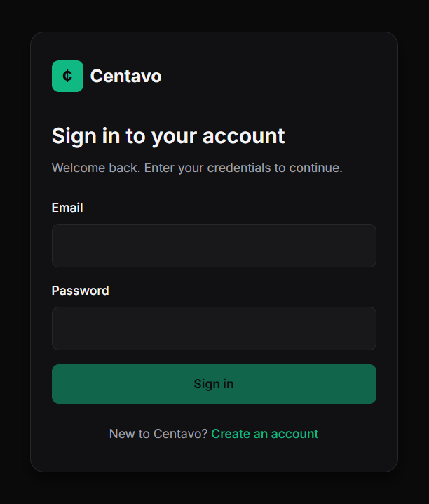
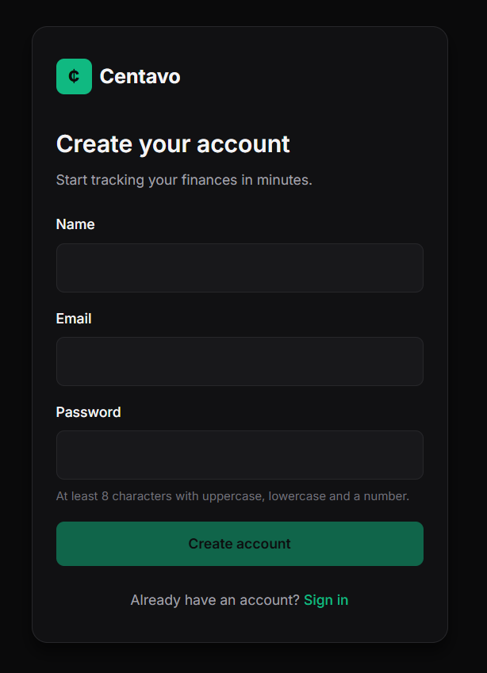

# Centavo

Personal finance manager with multi-format import (OFX, CSV, manual). Built as a portfolio project to demonstrate fullstack development with Angular and NestJS.

> Currently under active development

## Highlights

- **Single-page app** built with Angular 21, signals, and standalone components
- **REST API** built with NestJS 11 and Prisma 6
- **Multi-user** with JWT authentication and rotating refresh tokens
- **Architecture Decision Records** documenting every non-trivial decision
- **Mobile-first**, dark-themed UI built from scratch, no UI library

## Screenshots

<table>
  <tr>
    <td></td>
    <td></td>
  </tr>
  <tr>
    <td align="center"><strong>Login</strong></td>
    <td align="center"><strong>Register</strong></td>
  </tr>
</table>


## Stack

| Layer       | Tech                                          |
|-------------|-----------------------------------------------|
| Frontend    | Angular 21 (standalone, signals, zoneless)    |
| Backend     | NestJS 11, Prisma 6, PostgreSQL 16            |
| Auth        | JWT (15min) + rotating refresh tokens (7d)    |
| Monorepo    | Nx with shared TypeScript types               |
| Styling     | SCSS + CSS variables (no UI library)          |
| Testing     | Jest (backend unit tests)                     |

## Architecture

```
centavo/
├── apps/
│   ├── api/    # NestJS backend
│   └── web/    # Angular frontend
└── libs/
    └── shared-types/    # Shared DTOs and interfaces
```

## Running locally

### Prerequisites
- Node.js 22+
- pnpm
- Docker

### Setup

```bash
# Install dependencies
pnpm install

# Start database
docker compose up -d

# Configure environment
cp apps/api/.env.example apps/api/.env

# Run migrations
cd apps/api && npx prisma migrate dev && cd ../..

# Start backend (terminal 1)
pnpm nx serve api

# Start frontend (terminal 2)
pnpm nx serve web
```

Backend runs at `http://localhost:3333`, frontend at `http://localhost:4200`.


## License

MIT